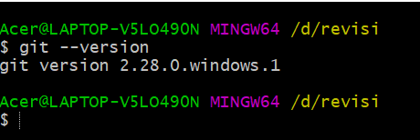
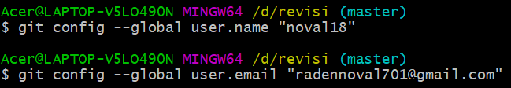
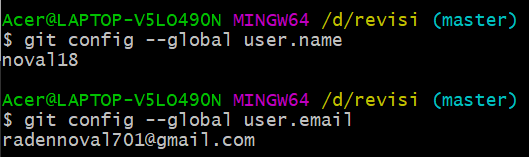
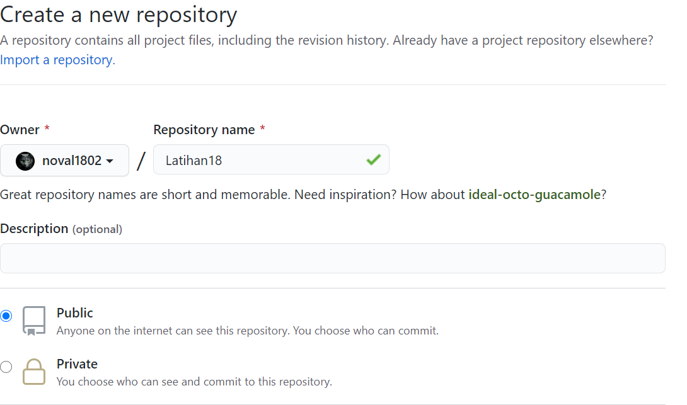
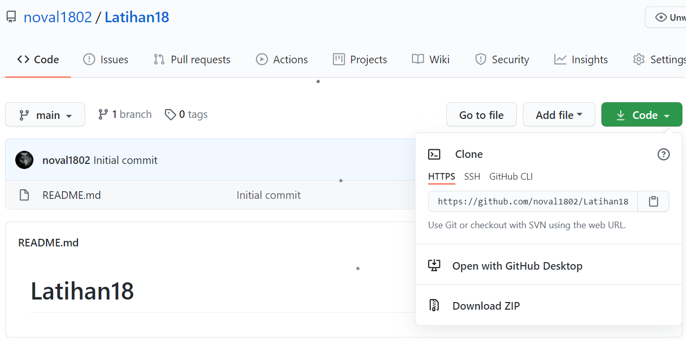

# Latihan18

Repository ini dibuat untuk memenuhi tugas Pertemuan 4 - Bahasa Pemrograman.

**NAMA : Abdul Aziz Anaoval** 

**NIM : 312010049**

**KELAS : TI.20.A.1**

## Langkah-Langkah Penggunaan Git

* Dwonload Git terlebih dahulu, dengan link berikut ini : [click here](https://git-scm.com)  

* Setelah file terdownload, silahkan lakukan instalasi dengan referensi berikut ini :[Git Installation Guide](https://git-scm.com/book/en/v2/Getting-Started-Installing-Git)  

* Setelah installasi selesai, buka *software* **GitBash** pada menu di Windows, dan lakukan pengecekan **versi**, dengan mengetik syntax berikut :   

`git --version`  

* Jika muncul tampilan **git version**, berarti Git sudah **berhasil di install** dan **bisa digunakan**. Langkah pertama kita harus **mengkonfigurasi user nama dan email di Git**, dengan mengetikkan syntax berikut :  

`git config --global user.name "masukan nama anda"`  
`git config --global user.email "masukan email anda"`  

* Setelah diisi, silahkan lakukan pengecekan user nama dan email, dengan mengetikkan perintah berikut :

`git config --global user.name`  
`git config --global user.email`  

* Buat akun di **GitHub**,seperti contoh dibawah ini.Dan lakukan Verifikasi akun melalui email yang sudah terdaftar.  

* Jika akun **GitHub** sudah selesai dibuat dan di verifikasi,proses selanjutnya silahkan buat Repository seperti gambar dibawah ini:  

* Jika repository sudah dibuat maka akan muncul tampilan seperti dibawah ini :  

