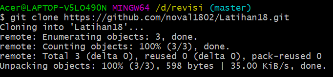
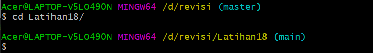
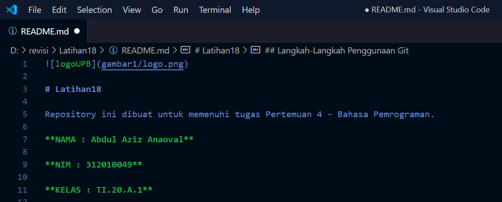
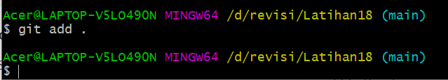
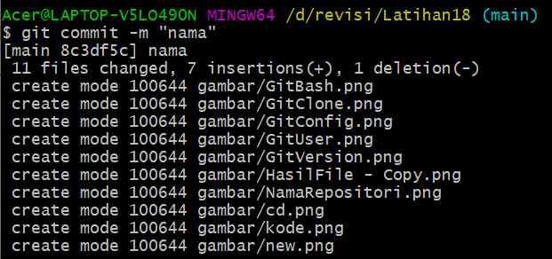
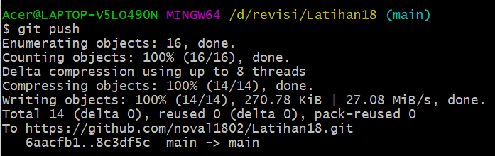
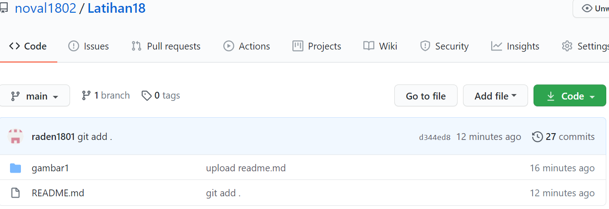

# Latihan18

#### Repository ini dibuat untuk memenuhi tugas Pertemuan 4 - Bahasa Pemrograman.

**NAMA : Abdul Aziz Anaoval** 

**NIM : 312010049**

**KELAS : TI.20.A.1**

## Langkah-langkah penggunaan git

* Download Git terlebih dahulu, dengan link berikut ini : [click here](https://git-scm.com)  

* Setelah file terdownload, silahkan lakukan instalasi dengan referensi berikut ini : [Git Installation Guide](https://git-scm.com/book/en/v2/Getting-Started-Installing-Git)  

* Setelah installasi selesai, buka *software* **GitBash** pada menu di Windows, dan lakukan pengecekan **versi**, dengan mengetik syntax berikut :   

`git --version`  

* Jika muncul tampilan **git version**, berarti Git sudah **berhasil di install** dan **bisa digunakan**. Langkah pertama kita harus **mengkonfigurasi user nama** dan **email** di **Git**, dengan mengetikkan syntax berikut :  

> `git config --global user.name "masukan nama anda"`  
> `git config --global user.email "masukan email anda"`  

* Setelah diisi, silahkan lakukan pengecekan user nama dan email, dengan mengetikkan perintah berikut :

> `git config --global user.name`  
> `git config --global user.email`  

* Buat akun di **GitHub**,seperti contoh dibawah ini.Dan lakukan Verifikasi akun melalui email yang sudah terdaftar.  

* Jika akun **GitHub** sudah selesai dibuat dan di verifikasi,proses selanjutnya silahkan buat Repository seperti gambar dibawah ini: **Penjelasan**   

> * `Repository Name : (Silahkan isi nama repository yang diinginkan, seperti contoh saya ingin membuat repository LatihanVCS)`  

> * `Description : (Isi dengan deskripsi atau penjelasan tentang repository Anda)`   

> * `Public / Private : (PIlih salah satu jenis repository akan bisa dilihan sama semua orang atau tidak)`  

> * `Add a README.md file : Centang pada bagian ini jika Anda menginginkan file README.md ada di repository Anda`  

> * `Add .gitignore : Merupakan sebuah file yang berisi daftar nama-nama file dan direktori yang akan diabaikan oleh Git.`  

> * `Choose a license : Silahkan centang jika Anda memiliki lisensi pada repository yang akan dibuat Kemudian tekan tombol Create Repository untuk menyimpan`  

* Jika repository sudah dibuat maka akan muncul tampilan seperti dibawah ini :  

* Pembuatan akun dan repository pada Github telah selesai, saat ini akan kita lakukan untuk *me-remote* repository Github pada GitBash Lokal. Bagaimana caranya? Langkah pertama kita harus menyalin link *URL git* kita di Github, dengan cara tekan tombol **Code** lalu klik *Copy*.

* Setelah *Link URL* git kita *tercopy*, Silahkan buka File Explorer pada Windows, kemudian pilih folder dimana kita akan *mendownload* Repository dari Github ke lokal. Kemudian Klik Kanan, Pilih **Git Bash Here.**  

* *Pop Up* Command Prompt **(CMD)** akan terbuka. Pada proses ini kita akan melakukan download file repository yang tadi dibuat, dengan mengetikkan *syntax* berikut :

`git clone [URL] pada contohnya, saya akan memasukan git clone`  
https://github.com/noval1802/Latihan18.git

  

* Setelah proses cloning selesai, pada saat ini kita masih pada folder awal (master), kita harus masuk kedalam folder yang telah dicloning tadi yaitu *LatihanVCS* dengan mengetikkan *syntax* berikut :

> `cd Latihan18/`

* Saat ini kita sudah masuk kedalam folder *LatihanVCS*, Silahkan edit file README.md yang ada di File Explorer. Bisa menggunakan Text Editor *(Sublime Text, Notepad, Notepad++, Visual Studio Code)*. Edit sesuai dengan keinginan. Aturan file .md (Markdown) bisa dilihat di Link berikut ini : [click here](https://guides.github.com/features/mastering-markdown/)  

  

* Setelah file README.md diedit, silahkan Simpan file tersebut dengan cara **CTRL+S** atau **File** -> **Save**  

* Langkah selanjutnya setelah file disimpan, kita kembali pada App Git Bash **(CMD)**. Ketik pada Git Bash seperti berikut ini :  

> `git add .`

* Setelah selesai melakukan *git add* . langkah berikutnya kita akan melakukan *commit*. Fungsi commit adalah untuk menyimpan perubahan yang dilakukan, tetapi tidak ada perubahan pada remote repository. Ketik pada App Git Bash seperti berikut ini :

`git commit "Update README.md"`

* Git *commit* telah selesai di lakukan. Untuk saat ini akan melakuka Git Push, Git Push berfungsi untuk mengirimkan perubahan file setelah di commit ke remote repository. Silahkan ketik pada App Git Bash seperti berikut :  

`git push`

* Semua proses telah selesai, silahkan kembali ke Web Browser untuk melihat perubahan yang telah di *commit* dan *push* dari remote.  

  

# Sekian TERIMAKSIH. 

## Semoga bisa di fahami:) 